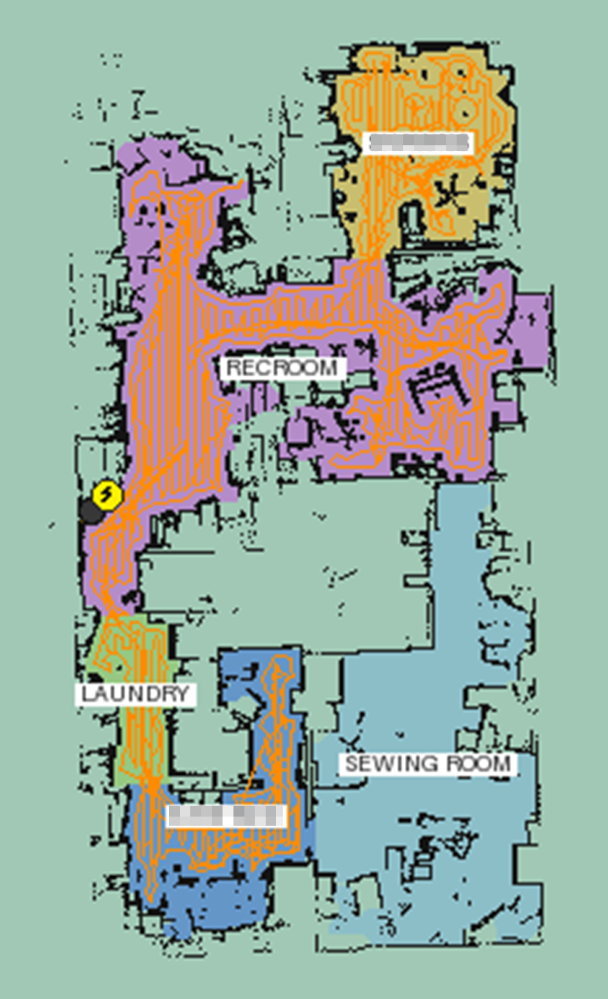

# Eufy Clean — Home Assistant Integration

Full-featured Home Assistant custom component for Eufy robot vacuums. Controls cleaning scenes, individual rooms, dock station, and streams a live floor map — all over MQTT with no cloud polling.

[](https://github.com/hacs/integration)
[](https://github.com/jeppesens/eufy-clean/releases)
[](https://github.com/jeppesens/eufy-clean/commits/main)
[](LICENSE)
[](https://github.com/jeppesens)
[](https://github.com/jeppesens/eufy-clean/actions/workflows/hassfest.yaml)
[](https://github.com/jeppesens/eufy-clean/actions/workflows/hacs_validation.yaml)

> ⭐ **Help others find this integration!** If it's working well for you, please star this repository.
>
> [](https://github.com/jeppesens/eufy-clean/stargazers) [](https://github.com/jeppesens/eufy-clean/network/members)

---

## FAQ
- Requires an MQTT-enabled Eufy vacuum (e.g. RoboVac X10 Pro Omni, C28 Omni, X9 Pro, L70, G50, and others — see supported models below)
- Tested on X10 Pro Omni and C28 Omni; should work on other MQTT-capable models
- Personal project maintained for Home Assistant users. Contributions welcome!

> [!NOTE]
> This integration is a fork of [martijnpoppen/eufy-clean](https://github.com/martijnpoppen/eufy-clean) with significant new features added, including a live floor map camera, error notifications, off-peak charging, and more.

---

## Features

### Live Floor Map Camera
A live floor plan camera entity (`camera.<device>_map`) streams the robot's map in real time via MQTT. No Tuya developer account or additional credentials needed.



- **Room-coloured rendering** — rooms colour-coded and labelled with names from the Eufy app
- **No-go zones and virtual walls** — forbidden zones (red), ban-mop zones (orange), virtual walls (red lines) as overlays
- **Live robot position** — tracks position in two styles: orange with googly eyes (default) or plain dark dot
- **Dock icon** — gold house icon marks the dock; robot snaps to it when docked
- **Status badges** — coloured badge next to robot: lightning bolt (charging, disappears at 100%), water drop (washing), snowflake (drying), dust icon (emptying)
- **Cleaning trail** — orange line traces the robot's path; clears on new session, survives HA restarts, preserved across brief auto-empty dock visits
- **Persistent map** — map and room data saved to storage and restored on restart

Map size (256/512/1024/2048 px) and robot marker style configurable via integration options.

### Vacuum Control
- **Start / Stop / Pause** cleaning operations
- **Return to dock** command
- **Scene Selection** — trigger pre-configured cleaning scenes via select entity or service call
- **Room-specific cleaning** — clean individual rooms or combinations
- **Battery monitoring** — level and charging status
- **Find Robot** — locate device by playing a sound

### Cleaning Parameters
Select entities exposed per device (hidden until supported DPS fields are received):

| Entity | Options |
|--------|---------|
| Suction Level | Quiet, Standard, Turbo, Max, Boost IQ |
| Cleaning Mode | Vacuum, Mop, Vacuum and mop, Mopping after sweeping |
| Water Level | Low, Medium, High |
| Mop Intensity | Quiet, Automatic, Max *(Matter-compatible alias for Water Level)* |
| Cleaning Intensity | Normal, Narrow, Quick |
| Voice Language | 17 languages: English, German, French, Spanish, Japanese, and more |

### Dock Tasks
Action buttons for: **Wash mop**, **Dry mop**, **Stop dry mop**, **Empty dust bin**

### Dock Configuration

| Setting | Options |
|---------|---------|
| Wash Frequency Mode | ByRoom / ByTime |
| Wash Frequency Value | 15–25 minutes |
| Auto Mop Washing | On / Off |
| Dry Duration | 2h / 3h / 4h |
| Auto Empty | On / Off |
| Auto Empty Mode | Smart, 15 / 30 / 45 / 60 min |
| Off-Peak Charging | On / Off + start/end time |

### Error Notifications
Sends a notification when the robot reports an error (Wheel Stuck, Sensor Dirty, etc.):

- **Desktop notification** (toggle) — shows in the HA bell icon, auto-dismissed when the error clears
- **Mobile push** (dropdown) — pick your phone from discovered Companion App devices or type a service name; leave blank to skip mobile alerts

> [!NOTE]
> Error codes are reported by the **robot** via MQTT. Dock hardware faults (error light on the station) use a separate channel not currently accessible via MQTT and will not trigger notifications.

### Sensors

| Sensor | Notes |
|--------|-------|
| Battery level | % |
| Charging status | Binary |
| Work status & mode | Retained across docking |
| Cleaning area | Retained until next clean |
| Total cleaning area / time / count | Lifetime stats |
| Dock firmware version | Station FW |
| Error code & description | Real-time |
| Accessory life remaining | Filter, brushes, mop, tray (hours) |

**Extended device info:** Serial number, MAC address, firmware version in the HA device panel.

### Accessory Reset Buttons
Dedicated reset buttons for each consumable (filter, side brush, rolling brush, sensors, mop, cleaning tray).

> [!NOTE]
> The Eufy App tracks two types: "Maintenance" (app-calculated, not via MQTT) and "Replacement" (actual firmware usage). This integration tracks Replacement life only.

### Segment Change Detection
When rooms are added, removed, or renamed, the integration raises a **Repair issue** under Settings → System → Repairs. Useful if you use [home-assistant-matter-hub](https://github.com/RiDDiX/home-assistant-matter-hub).

### Matter Hub Support
Room segments with guaranteed unique names (duplicates auto-suffixed, e.g. `Kitchen (2)`). **Mop Intensity** uses Matter-compatible option names (`Quiet`, `Automatic`, `Max`).

---

## Supported Devices

| Series | Models |
|--------|--------|
| X-Series | T2261, T2262, T2266, T2276, T2320, T2351 (X8, X8 Pro, X9 Pro, X10 Pro Omni) |
| C-Series | T1250, T2117, T2118, T2120, T2128, T2130, T2132, T2280, T2292 (C20, C28 Omni) |
| L-Series | T2190, T2267, T2268, T2278 (L60, L70) |
| G-Series | T2210–T2278 (G20, G30, G35, G40, G50) |
| S-Series | T2119, T2080 (RoboVac 11S, S1) |

---

## Installation

[](https://my.home-assistant.io/redirect/hacs_repository/?owner=jeppesens&repository=eufy-clean&category=integration)

1. Click the button above → **Open Link** → **Add** in HACS
2. Click **Download** (bottom right) → **Download** on the version prompt
3. Restart Home Assistant
4. Add the integration:

[](https://my.home-assistant.io/redirect/config_flow_start/?domain=robovac_mqtt)

5. Enter your Eufy account email and password

> [!NOTE]
> This integration requires the [Pillow](https://python-pillow.org/) image library for live map rendering. Home Assistant installs it automatically from PyPI when the integration first loads — no manual action needed.

---

## Options (gear icon)

| Setting | Default | Notes |
|---------|---------|-------|
| Map image size | 512 px | 256 / 512 / 1024 / 2048 px |
| Robot marker style | Googly Eyes | Googly Eyes / Dot |
| Desktop notification | Off | HA bell icon on robot errors |
| Mobile notification service | *(blank)* | Select phone or type `mobile_app_name`; blank = disabled |

> [!TIP]
> Changes made via HA may not appear in the Eufy mobile app immediately — navigate away and back in the app to refresh the state.

---

## Usage

### Cleaning Scenes

```yaml
action: vacuum.send_command
data:
  command: scene_clean
  params:
    scene_id: 5
target:
  entity_id: vacuum.eufy_omni_c28
```

Default scenes are typically 1–3; custom scenes start at 4+. Find IDs in the **Scene/Task** select entity.

### Room Cleaning

```yaml
action: vacuum.send_command
target:
  entity_id: vacuum.eufy_omni_c28
data:
  command: room_clean
  params:
    map_id: 4
    room_ids: [3, 4]
    fan_speed: "Turbo"
```

### Multi-Room Custom Settings

```yaml
action: vacuum.send_command
target:
  entity_id: vacuum.eufy_omni_c28
data:
  command: room_clean
  params:
    map_id: 4
    rooms:
      - id: 3       # Kitchen
        fan_speed: "Turbo"
        clean_mode: "vacuum_mop"
        water_level: "High"
      - id: 4       # Hallway
        fan_speed: "Quiet"
        clean_mode: "vacuum"
```

### Map and Room IDs
- **Active Map sensor** — `sensor.<device>_active_map` shows the current map ID (needed for service calls)
- **Room IDs** — available in the vacuum entity's `rooms` / `segments` state attributes; inspect via **Developer Tools → States**

> [!TIP]
> "Unable to identify position" usually means the `map_id` doesn't match the vacuum's current map. Check the Active Map sensor.

---

## Known Limitations

- **Robot position not shown on first install** — appears after the first cleaning run or docking event. No MQTT command exists to request current position while idle.
- **Dock hardware faults** — error light on the station itself is not exposed via MQTT and will not trigger notifications.
- **Map switching** — not supported; switch maps in the Eufy app.

---

## Development

### Local Testing
A `docker-compose.yml` is included for local development:

```bash
docker compose up
```

Starts a local HA instance at `http://localhost:8123` with the component mounted from `custom_components/robovac_mqtt/`.

### Running Tests

```bash
pip install -r requirements_test.txt
pytest
pytest tests/test_parser.py -v
```

### Lint

```bash
pre-commit run --all-files
mypy custom_components/robovac_mqtt/
```

---

## Support

- **Issues:** [GitHub Issues](https://github.com/jeppesens/eufy-clean/issues)

---

## Credits & Attribution

- **Original Integration:** [@martijnpoppen](https://github.com/martijnpoppen) — created the foundation
- **Maintainer:** [@jeppesens](https://github.com/jeppesens) — ongoing maintenance and improvements
- **Contributor:** [@smcneece](https://github.com/smcneece) — live map camera, error notifications, off-peak charging, and additional sensors

## Codeowners

- **[@jeppesens](https://github.com/jeppesens)** — active maintainer
- **[@m11tch](https://github.com/m11tch)** — codeowner

---

## License

MIT License. See [LICENSE](LICENSE). This integration is not affiliated with or endorsed by Eufy / Anker Innovations. Use at your own risk; no warranty is provided.

---

<!-- SEO Keywords
eufy, eufy clean, eufy robovac, eufy vacuum, home assistant, hacs, custom component,
robot vacuum, eufy x10 pro omni, eufy c28 omni, eufy x9 pro, eufy l70, eufy g50,
eufy mqtt, robovac mqtt, room cleaning, floor map, live map, eufy integration,
home assistant vacuum, eufy home assistant, anker eufy, robot vacuum automation
-->
