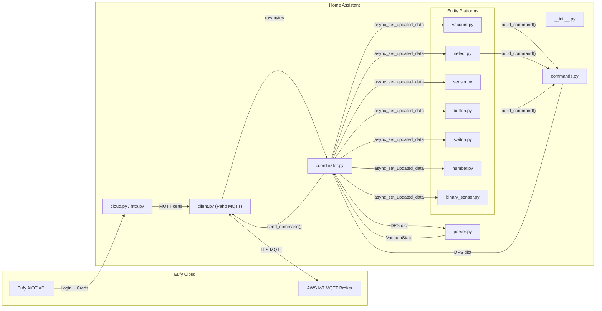
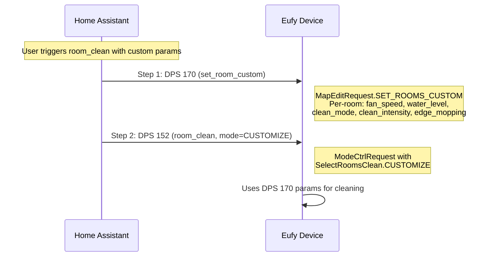
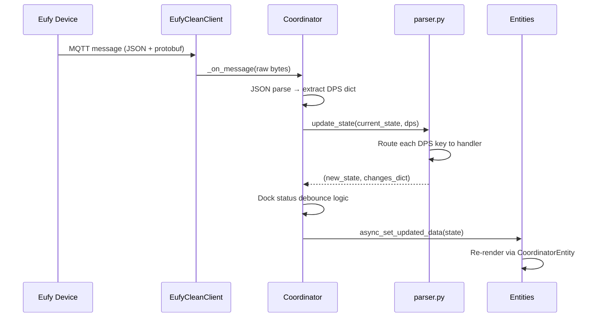
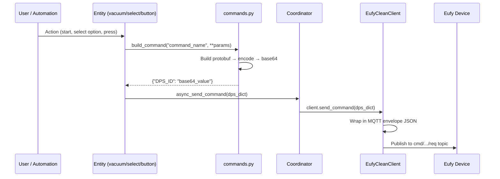

# Eufy Clean MQTT Integration — Architecture Guide

> **Audience**: Contributors and anyone reviewing or extending this integration.

---

## High-Level Architecture



---

## Startup Flow

1. **`__init__.py → async_setup_entry()`**
   - Reads `CONF_USERNAME` / `CONF_PASSWORD` from `config_entry.data`
   - Creates `EufyLogin` and calls `eufy_login.init()` (login + device discovery)
   - For each discovered device, creates an `EufyCleanCoordinator` and calls `coordinator.initialize()`
   - Stores coordinators in `hass.data[DOMAIN][entry.entry_id]`
   - Forwards setup to all platforms: `VACUUM`, `BUTTON`, `SENSOR`, `SELECT`, `SWITCH`, `NUMBER`, `BINARY_SENSOR`

2. **`cloud.py → EufyLogin.init()`**
   - Calls `http.py → EufyHTTPClient.login()` to authenticate via `https://home-api.eufylife.com/v1/user/email/login`
   - Retrieves MQTT credentials (client certificates, endpoint, user ID, thing name)
   - Calls `getDevices()` → fetches device list from `https://aiot-clean-api-pr.eufylife.com/app/devicerelation/get_device_list`
   - Merges with cloud device list for model names, aliases, firmware versions
   - Filters to `mqtt_devices` (valid devices only)

3. **`client.py → EufyCleanClient.connect()`**
   - Writes PEM cert + private key to temp files
   - Creates Paho MQTT client with mTLS
   - Connects to AWS IoT endpoint
   - Subscribes to device topics: `cmd/eufy_home/{model}/{device_id}/res`

---

## MQTT Protocol

### Topic Format

| Direction | Topic Pattern |
|-----------|--------------|
| **Subscribe** (device → HA) | `cmd/eufy_home/{model}/{device_id}/res` |
| **Publish** (HA → device) | `cmd/eufy_home/{model}/{device_id}/req` |

### Message Envelope

Both incoming and outgoing messages use the same JSON wrapper:

```json
{
  "head": {
    "client_id": "android-{app_name}-eufy_android_{openudid}_{user_id}",
    "cmd": 65537,
    "cmd_status": 2,
    "version": "1.0.0.1",
    "timestamp": 1704326400000
  },
  "payload": "{\"account_id\": \"...\", \"data\": {\"152\": \"base64...\", \"153\": \"base64...\"}, \"device_sn\": \"...\", \"protocol\": 2, \"t\": 1704326400000}"
}
```

The `payload` is a JSON string containing a `data` object — this is the **DPS dictionary** (Data Point Slots). Each key is a DPS ID (string), and each value is typically a base64-encoded protobuf message.

---

## DPS Map — Data Point Slots

The DPS system is how the Eufy device communicates state and receives commands. Each DPS ID maps to a specific function. Defined in `const.py → DPS_MAP`:

| DPS ID | Key | Direction | Protobuf Type | Description |
|--------|-----|-----------|---------------|-------------|
| **152** | `PLAY_PAUSE` | Write | `ModeCtrlRequest` | Play/Pause/Stop/GoHome — the main control channel |
| **153** | `WORK_STATUS` | Read | `WorkStatus` | Current device state (activity, charging, mode, scene, station sub-status) |
| **154** | `CLEANING_PARAMETERS` | R/W | `CleanParamRequest` / `CleanParamResponse` | Global cleaning defaults (fan speed, clean type, water level). **Only applies to auto clean; overridden by per-room config via DPS 170** |
| **155** | `DIRECTION` | Write | — | Joystick/directional control |
| **156** | `MULTI_MAP_SW` | Write | — | Multi-map switch |
| **158** | `CLEAN_SPEED` | Read | Integer index | Fan speed level (0=Quiet, 1=Standard, 2=Turbo, 3=Max) |
| **160** | `FIND_ROBOT` | R/W | Boolean | Triggers the "find my robot" beep |
| **163** | `BATTERY_LEVEL` | Read | Integer | Battery percentage (0–100) |
| **164** | `MAP_EDIT` | Read | `MapEditRequest` | Map edit data; used to read room data on some models (e.g. C20 via `MAP_EDIT` DPS) |
| **165** | `MAP_DATA` | Read | `UniversalDataResponse` / `RoomParams` | Room list + map ID |
| **166** | `MAP_STREAM` | Read | — | Real-time map stream data |
| **167** | `CLEANING_STATISTICS` | Read | `CleanStatistics` | Cleaning duration and area |
| **168** | `ACCESSORIES_STATUS` | Read | `ConsumableResponse` | Filter, brush, sensor, mop usage hours |
| **169** | `MAP_MANAGE` | Write | — | Map management operations |
| **170** | `MAP_EDIT_REQUEST` | Write | `MapEditRequest` | Set per-room custom cleaning parameters (fan speed, water level, clean mode, intensity per room) |
| **173** | `STATION_STATUS` | Read | `StationResponse` | Dock station status (washing, drying, emptying, water levels, auto config) |
| **176** | `UNSETTING` | Write | — | Unisetting configuration |
| **177** | `ERROR_CODE` | Read | `ErrorCode` | Device error codes (see `EUFY_CLEAN_ERROR_CODES` in const.py for full list) |
| **180** | `SCENE_INFO` | Read | `SceneResponse` | Cleaning scenes (user-defined cleaning presets with room/zone configs) |

### DPS 154 vs DPS 170 — Cleaning Parameters

This is a critical distinction:

- **DPS 154** (`CLEANING_PARAMETERS`) — Sets *global default* cleaning parameters. These apply when triggering `auto_clean` (Start button). Values include fan speed, clean type (vacuum/mop/both), water level, and cleaning intensity.
- **DPS 170** (`MAP_EDIT_REQUEST`) — Sets *per-room* cleaning parameters via `MapEditRequest.SET_ROOMS_CUSTOM`. Each room can have its own fan speed, water level, clean mode, clean intensity, and edge mopping setting. These values **override** DPS 154 during room-specific cleaning.

When a `room_clean` command is triggered, the device uses the per-room parameters from DPS 170, **not** the global defaults from DPS 154.

### Room Clean with Custom Parameters — Two-Step Flow

Custom room cleaning is a two-step MQTT sequence:



**Step 1** — `build_set_room_custom_command()` sends a `MapEditRequest` to DPS 170 with per-room cleaning parameters. Each room can have its own fan speed, water level, clean mode, clean intensity, and edge mopping setting.

**Step 2** — `build_room_clean_command()` sends a `ModeCtrlRequest` to DPS 152 with `mode=CUSTOMIZE`, telling the device to use the custom parameters just configured.

If **no custom parameters** are provided, only Step 2 is sent with `mode=GENERAL`, and the device uses its stored per-room defaults.

The integration supports two input formats for custom room parameters:
- **New format**: `rooms` — a list of dicts, each with `{id, fan_speed, water_level, ...}` allowing different settings per room
- **Legacy format**: `room_ids` — a list of ints plus global params applied to all rooms

---

## Data Flow — Incoming (Device → HA)



### Parser Routing (`parser.py → update_state()`)

The parser dispatches each DPS key to a specialized handler:

```
DPS 153 (WORK_STATUS)     → _process_work_status()    → activity, task_status, charging, trigger_source, dock_status, scene
DPS 173 (STATION_STATUS)  → _process_station_status()  → dock_status, clean_water, dock_auto_cfg
DPS 163 (BATTERY_LEVEL)   → changes["battery_level"]
DPS 158 (CLEAN_SPEED)     → _map_clean_speed()         → fan_speed
DPS 177 (ERROR_CODE)      → ErrorCode proto             → error_code, error_message
DPS 168 (ACCESSORIES)     → _parse_accessories()        → filter/brush/mop usage
DPS 167 (CLEAN_STATS)     → CleanStatistics proto       → cleaning_time, cleaning_area
DPS 180 (SCENE_INFO)      → _parse_scene_info()         → scenes list
DPS 165 (MAP_DATA)        → _parse_map_data()            → rooms list, map_id
DPS 160 (FIND_ROBOT)      → changes["find_robot"]
```

### Dock Status Debounce

The coordinator implements a 2-second debounce for dock status changes to prevent UI flapping during rapid state transitions (e.g., washing → drying):

1. When `dock_status` changes in `changes` dict, a 2s timer starts
2. During the timer, all state updates use the *old* dock status
3. When the timer fires, the pending status is committed
4. If a new status arrives before the timer, it restarts

---

## Data Flow — Outgoing (HA → Device)



### Command Builder (`commands.py`)

`build_command()` is the unified entry point. It routes by command name:

| Command | Builder Function | DPS | Protobuf |
|---------|-----------------|-----|----------|
| `auto_clean` | `_build_mode_ctrl(0)` | 152 | `ModeCtrlRequest` |
| `room_clean` | `build_room_clean_command()` | 152 | `ModeCtrlRequest` |
| `scene_clean` | `build_scene_clean_command()` | 152 | `ModeCtrlRequest` |
| `stop` | `_build_mode_ctrl(12)` | 152 | `ModeCtrlRequest` |
| `pause` | `_build_mode_ctrl(13)` | 152 | `ModeCtrlRequest` |
| `resume` | `_build_mode_ctrl(14)` | 152 | `ModeCtrlRequest` |
| `go_home` | `_build_mode_ctrl(6)` | 152 | `ModeCtrlRequest` |
| `set_fan_speed` | `build_set_clean_speed_command()` | 158 | Integer |
| `set_room_custom` | `build_set_room_custom_command()` | 170 | `MapEditRequest` |
| `reset_accessory` | `build_reset_accessory_command()` | 168 | `ConsumableRequest` |
| `set_auto_action_cfg` | `build_set_auto_action_cfg_command()` | 173 | `StationRequest` |
| `find_robot` | `build_find_robot_command()` | 160 | Boolean |

### Protobuf Encoding (`utils.py`)

All protobuf payloads use the same encoding scheme:

```
Raw message bytes → Varint length prefix → Base64 encode → String in DPS dict
```

Decoding is the reverse: `Base64 → Skip varint prefix → Protobuf.FromString()`

---

## State Model (`models.py`)

```python
VacuumState
├── activity: str              # "idle", "cleaning", "docked", "error", "returning"
├── battery_level: int         # 0-100
├── fan_speed: str             # "Quiet", "Standard", "Turbo", "Max"
├── error_code / error_message
├── charging: bool
├── cleaning_time / cleaning_area
├── task_status: str           # Detailed: "Cleaning", "Washing Mop", "Returning", etc.
├── find_robot: bool
├── map_id: int
├── rooms: list[dict]          # [{id: 1, name: "Kitchen"}, ...]
├── scenes: list[dict]         # [{id: 1, name: "Daily Clean", type: 1}, ...]
├── dock_status: str           # "Idle", "Washing", "Drying", "Emptying dust", etc.
├── station_clean_water: int
├── station_waste_water: int
├── dock_auto_cfg: dict        # Auto-empty, auto-wash settings
├── trigger_source: str        # "app", "button", "schedule", "robot"
├── current_scene_id / name
├── accessories: AccessoryState  # Filter/brush/mop usage hours
├── preferences: CleaningPreferences  # fan_speed, water_level defaults
├── raw_dps: dict              # All raw DPS data for diagnostics
└── received_fields: set[str]  # Tracks which fields the device has reported (for entity availability)
```

The `received_fields` set is important — sensors and select entities use it to determine availability. If a device never reports `dock_status`, the dock sensor won't appear as available. This avoids showing entities for features the device doesn't support.

---

## Entity Platform Summary

### vacuum.py — `RoboVacMQTTEntity`

The main entity. Exposes:
- **Features**: Start, Pause, Stop, Return Home, Fan Speed, Send Command, Locate, Clean Spot
- **Fan speed list**: Quiet, Standard, Turbo, Max (novel series)
- **`async_send_command()`** — Supports string commands: `auto_clean`, `room_clean`, `scene_clean`, `go_home`, `stop`, `pause`
- **`extra_state_attributes`** — Exposes rooms, task_status, error_message, trigger_source, dock_status, cleaning stats

### select.py — Select Entities

| Entity | ID Suffix | What It Controls |
|--------|-----------|-----------------|
| `SceneSelectEntity` | `_scene` | Triggers cleaning scenes |
| `RoomSelectEntity` | `_room` | Triggers room-specific cleaning |
| `DockSelectEntity` (multiple) | `_wash_freq_mode`, `_dry_duration`, `_collect_dust_mode` | Dock station settings |

### sensor.py — Sensor Entities

Battery, task status, dock status, error, trigger source, cleaning time/area, water levels, and accessory remaining life (filter, brush, mop, etc.)

### button.py — Action Buttons

Dock actions (Dry Mop, Wash Mop, Empty Dust, Stop Dry) and accessory reset buttons.

### switch.py / number.py / binary_sensor.py

Additional config entities for auto-empty toggle, continuous cleaning, carpet boost, etc.


